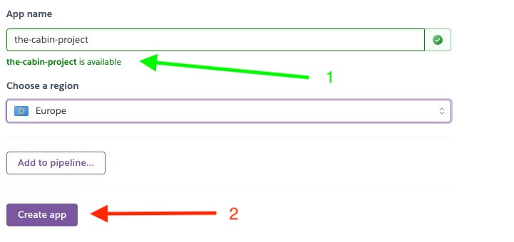

# **The Cabins**

This is the fourth milestone project in the Code Institute Full Stack Developer program. The project is a full-stack framework and has been built for educational purposes. The technologies used for this project are HTML, CSS, JavaScript, Python, and Django.

The Cabins is a fictional booking site for two cabins. One in the mountains of Sälen, Sweden and the ohter on the island of Öland, Swenden. 

[Find the live site here.](https://the-cabins-project.herokuapp.com/)

---

## **UX**
While planing this project / site I first started I broke it down to the 5 planes of:

- The Strategy Plane
- The Scope Plane
- The Structure Plane
- The Skeleton Plane
- The Surface Plane
---
### **The Strategy Plane**
Who am  I trying to reach and connect with in this site? The target audiance is hard to define seeing that the to cabins has different attractions. However, users visitng this site a here because they want a vaction...
There are ofcourse a couple of core components for this site.

- The User should have a easily navagated site wich are informative
- The User should be able to book / reserve a cabin on the site.
- The User should be able to log in to their account and manage their reservations 

#### **User Stories**

[User Stories](https://github.com/Callee84/Cabins/issues)

##### **Admin Goals**
- As a Site Admin I can See all bookings / reservations that's been made so that I can see manage the cabins bookings / reservations.
- As a Site Admin I can see all the bookings / reservations that been made on the front end so that I can overview the bookings / reservations without logging in back end
- As a Site Admin / User I can rely on authentication so that only I edit / delete my own news articles / post.
- As a Site Admin I can delete my news articles/ posts so that I can control my information to the user.
- As a Site Admin I can edit my news articles/posts so that I can control the content that I write for the user/ guest.
- As a Site Admin I can add news articles on the website so that I can keep users/ guests informed.

##### **User Goals**
- As a Site User I can see available dates for the cabins so that I can make a booking / reservation for a cabin on the website.
- As a Site User I can read / get information about the cabins so that I can make a informed decision about which cabin I want to book.
- As a Site User I can delete my posts so that I can control the posts I made on the website.
- As a Site User I can edit my blog posts so that I can control the content of my post.
- As a Site User I can log in to my account so that I can write posts in the guestbook.
- As a Site User I can see pictures of the cabins so that I know what the cabins look like before I make my booking/ reservation.
- As a Site User I can fill put a contact form so that I can contact the site administrators if I have any questions.

---
### **The Scope Plane**
In order to achieve the desired admin and user goals, the following features will be included in this website:

- Responsive navbar that will navigate to the various pages throughout the site
- Landing page with brief information about the cabins and the cabins locations.
- Register/login feature using Django allauth
- Contact for booking inquiry

---

## **The Structure Plane**
This website is made up with 5 apps (4 of which is connected to the front end)
- cabin_web - the core
- news - handles the news articles that admin manages
- guestbook - hadles the user created posts
- contact - handles the contact form
- cabin_reservation

### *The news app*
The Post model class porvides the model for the admin to create news articles which is dispalyed on the /news page. It also hold the form for which provides the form that is accessable though the front end.

### *The guestbook app*
Just like the news app, the guestbook app provides the model for the user to leave a feedback / post for everryone to read.

### *The contact app*
The contact app provides the form for which the user can send an email to the admin (me) with a question or inquiry for a reservation.

### *The cabin_reservation app*
In the cabin_reservation app is the models for Guest, Cabin and Booking. This provide the admin with the ability to handle bookings on the back end. There is also a form that will (in the future) give the user the abilitiy to book a cabin directily on the website

#### **Colors**

#FFFFFF 
- The white background is thoughout the whole site. To get a good contrast with the text and for a bright and crips feeling.

#41464C
- This dark grey is a very nice contrast for the footer. It stands out but is also a nice soft dark grey color.

#C8D9E8
- This crisp light greyblue color is set on the cards for the news article / guest posts to give them a bit of a "pop" and stand out.

#0D6EFD
- A Bootstrap color which I put on the buttons. 
- I've also used the Bootstrap color class of "danger" and "success" for edit/ delete and login/ register/ logout buttons on the site. 

**UserProfile**
- The user profile is connected to the User model created by Allauth on registration.

---

## **The Skeleton Plane**

The design for this website is kept clean and easy. With the execption for the split image on the Home page, the site operates on a bootstrap base of containers, rows, cards and carouels.

---

## **The Surface Plane**

### **Features**

**Navigation Bar**
The navbar is implemented on every page and is fully responsive across all resolutions.
Users can navigate across the site freely with links not only on the navbar but also thouhout the diffent pages.
If the user is logged in then they will see a `Welcome:` follwed by their name and beside that the `Sign Out` link. If the user isn't logged in then they will see a link for `Register` or `Log In` which of course will take the user to the respective pages. 

For the tablet and mobile devices I've used a collapsable navbar with a small animation when clicking the hamburger menu.

**Footer**

Just like the navigation bar, the footer is also implemented on every page containing adresses to both cabins and a Google Map showing their locations. Under the adresses fo the cabins I've provided links to their respective pages.  The color is set to a dark grey to stand out.

**Home Page**

The home page greets you with a nice snowy mountain image featuring a JavaScript function countdown. Just above the fold the is a H1 displaying a catchy(?) slogan inviting the user to scroll down where they will find an introduction for the cabins and links both below and in the images. There's an hover animation on both images which will show a a brief text and also a link to their respective page.

**Destination**

Whe clicking the the dropdown menu on the navbar you can choose to visit the cabin you want to see.

The two cabins is displayed on seperate pages wwith a similar layout. First a header image followd by some information insided a bootstrap card. 

Clicking the "More Information" button triggers a dropdown with some additional information about the cabins.

Scolling down there's a image carousel containig imagaes of the cabins. This carousel change images automatically but there's also navigation buttons so that you can choose yourself. Right below the carousel is a inquiry button which when clicked takes hte user to the contact page. 

**News**

The news page is desiged like a blog. Here the admin can post news article for the user. 

It requires authentication to be able to post a news article. If user is't authenicated then they recive an message if they would somehow access the post page. If authenticated the the user will get the option to add post.

**News Details**

When clicking on a news article the user will be taken to a new page where the full article can be read. If the user is authenticated then the options of `edit` and `delete` will also appear.

 

Editing the news takes the user to a new page to a form that is prepopulated with the aritcle the user want to edit. 
Clicking the delete button will trigger a modal wich will appear with information about the article. Deleting a post from the review page will trigger the same modal.

**Reviews**

The review page comes from the guestbook app. The name was changes in late development after input from users. 
The review page works very similar to the news page. Authenticated users can add and edit their own posts and also delete. When adding a post the guset will also choose a category in which the post relate to.

If the user is not authenticated the option off `add post` is not available. If they where to access the post page a message will be displayed instead of the post add form.

**Contact**

The contact page contains a contact from. Here the user can send their request / question and will choose subject from the dropdown list.

After sending email the user get redirected to a contact_sent page where they will recieve a messeage that confirms the email was sent.
If user is logged in when sending email the they will get a more personal message.

**

---

## Testing

Link to the Testing Document.
- [TESTING.md](/TESTING.md)

---

## **Technologies Used**

- [Python](https://www.python.org/) 
- *The following Python modules were used on this project,*
    - asgiref==3.5.2
    - cloudinary==1.30.0
    - dj-database-url==0.5.0
    - dj3-cloudinary-storage==0.0.6
    - Django==3.2.16
    - django-allauth==0.51.0    
    - django-reservation==0.2.10
    - django-summernote==0.8.20.0
    - gunicorn==20.1.0
    - oauthlib==3.2.2
    - psycopg2==2.9.5
    - PyJWT==2.6.0
    - python3-openid==3.2.0
    - pytz==2022.6
    - requests-oauthlib==1.3.1
    - sqlparse==0.4.3
- [Django](https://www.djangoproject.com/)
- [ElephantSQL](https://www.elephantsql.com/)
- [Bootstrap](https://getbootstrap.com/)
- [Google Fonts](https://fonts.google.com/)
- [Font Awesome](https://fontawesome.com/)
- [Google Developer Tools](https://developers.google.com/web/tools/chrome-devtools)
- [GitHub](https://github.com/)
- [Gitpod](https://www.gitpod.io/)
- [Heroku](https://dashboard.heroku.com/apps)
- [Cloudinary](https://cloudinary.com/)
- [Crispy Forms](https://django-crispy-forms.readthedocs.io/en/latest/)

---

## Deployment

### Github & Gitpod

I used the Code Institiue student template as a base for this project.

[Code Institute Full Template](https://github.com/Code-Institute-Org/gitpod-full-template)

- Click the *Use This Template* button.
- Give your repository a name, and description if you wish.
- Click the *Create Repository from Template* to create your repository. 
- Click the *Gitpod* button to create a gitpod workspace, this can take a few minutes.
- When working on project using Gitpod, please open the workspace from Gitpod, this will open your previous workspace rather than creating a new one.
Use the following commands to commit your work, 
- `git add . ` - adds all modified files to a staging area.
- `git commit -m "A short message exlaining your commit"` - commits all changes to a local repository.
- `git push` - pushes all your commited changes to your Github repository.

*Forking the GitHub Repository*

If you want to make changes to your repository without affecting it, you can make a copy of it by 'Forking' it. This ensures your original repository remains unchanged.

### Creating an Application with Heroku

I followed the below steps using the Code Institute tutorial, *with the updated information* and [Django Blog cheatsheat](https://codeinstitute.s3.amazonaws.com/fst/Django%20Blog%20Cheat%20Sheet%20v1.pdf)

- The following command in the Gitpod CLI will create the relevant files needed for Heroku to install your project dependencies `pip3 freeze --local > requirements.txt`. 
- A `Procfile` is also required that specifies the commands that are executed by the Heroku app on startup. 

1. Go to [Heroku.com](https://dashboard.heroku.com/apps) and log in; if you do not already have an account then you will need to create one.

2. Click the `New` dropdown and select `Create New App`.

3. Enter a name for your new project, all Heroku apps need to have a unique name, you will be prompted if you need to change it.

4. Select the region you are working in.

*Heroku Settings*
You will need to set your Environment Variables - this is a key step to ensuring your application is deployed properly.

- In the Settings tab, click on `Reveal Config Vars` and set the following variables:
    - CLOUDINARY_URL - to be set to your Cloudinary API environment variable
    - DATABASE_URL - to be set to your database *In my the URL to my ElephantSQL database*
    - PORT - 8000
    - SECRET_KEY - to be set to your chosen key
    - DISABLE_COLLECTSTATIC - 1

*Heroku Deployment*
In the Deploy tab:
1. Connect your Heroku account to your Github Repository following these steps:
    1. Click on the `Deploy` tab and choose `Github-Connect to Github`.
    2. Enter the GitHub repository name and click on `Search`.
    3. Choose the correct repository for your application and click on `Connect`.
2. You can then choose to deploy the project manually or automatically, automatic deployment will generate a new application every time you push a change to Github, whereas manual deployment requires you to push the `Deploy Branch` button whenever you want a change made.
3. Once you have chosen your deployment method and have clicked `Deploy Branch` your application will be built and you should see the below `View` button, click this to open your application:

## Credits

- Building this website I've used a lot of different sources to seach for functions & bug fixes.
- I've used boostrap as a core for style & CSS 
- The split image i found as a code along on youtube with credits to Code Instinct.
- For the news / post funcitions I've took inspiration from Code Institute's Walkthough project "I Think Therefore I Blog" and John Elder from Codemy.com.
- Images on this site was found on Pexels and was free to use. 

- Big thanks to Ed in Tutor support who helped me massivly when I had to drop the database and start over and also for help in solving some issues with authenticaitons.

- As always, a massive thanks to my mentor Harry Dhillon for pointing me in the right direction when I'm a bit lost.

