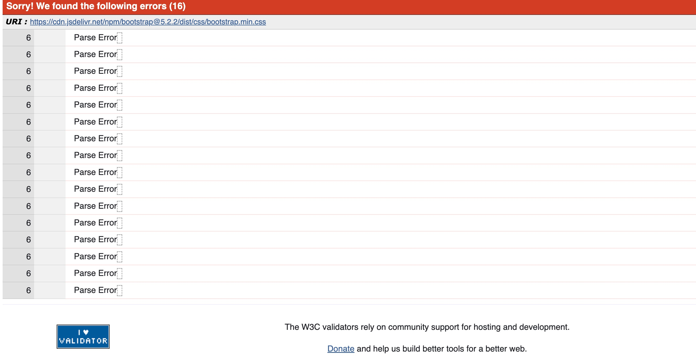
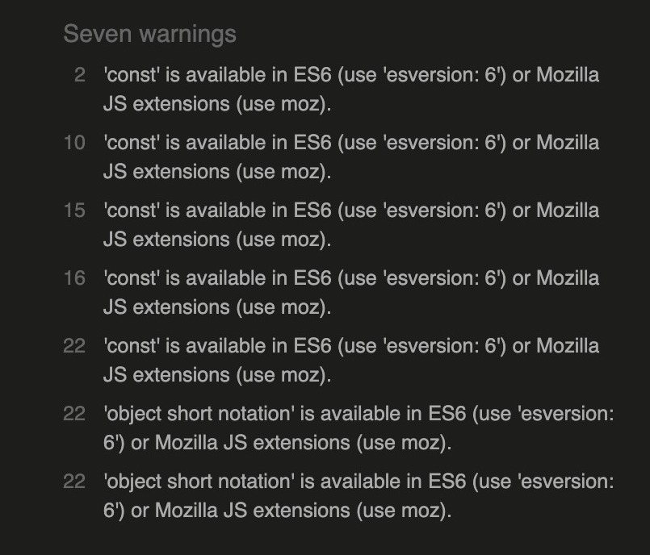

All of my code has been validated using an online validator specific to the language. 

- [W3C Markup Validation Service](https://validator.w3.org/) 
    - Used to validate all HTML code.

- [W3C CSS Validation Service](https://jigsaw.w3.org/css-validator/#validate_by_input)
    - Used to validate all CSS code.
    [Errors in W3C Jigsaw]
    * Passes with warings of parsing error connected to Bootstrap.

- [Pep8 CI Python Linter](https://pep8ci.herokuapp.com/)
    - Used to validate python code.
    * Pyhon code passes with no errors with exeptions for code in:
        - Settings - rows to long
        - Migrations - rows to long.
    
    These errors where left untouched.
    

- [JSHint](https://jshint.com/)
    - Used to validate JS code
    * Passes with warnigs of: 

