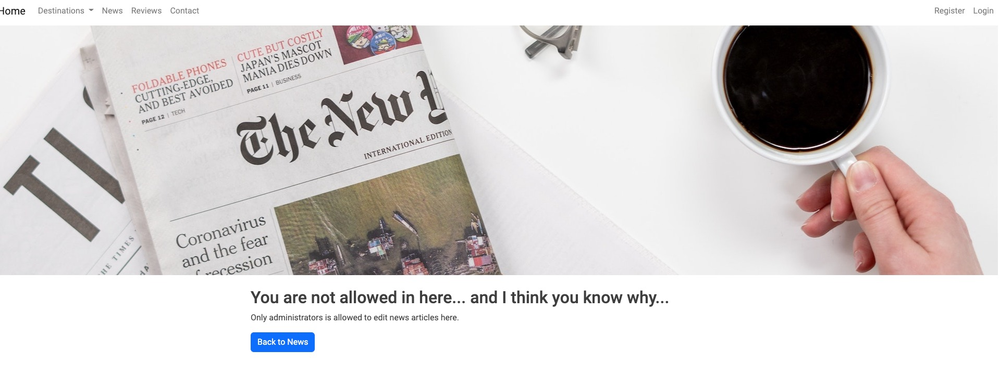
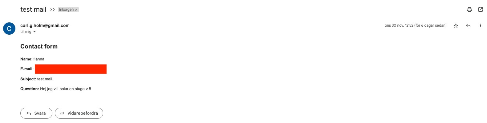

[Back to README](https://github.com/Callee84/Cabins#readme)

---

I've done manual testing of this site and I've also let friends and family test it on various divices and web browsers.

---

### **Manual Testing**

**Site**
- The site is fully responsive on large / medium and samll screen sizes.

**Navbar**
- Fully responsive on large / medium and small screen sizes.
    - Collapsable from 990 px width.
- All links are correctly redirecting to the correct pages.

**Footer**
- Fully responsive on large / medium and small screen sizes.

**Home Page**
- All links tested and redirects to the correct pages.

**Cabin Sälen**
- All links tested and redirects to the correct pages.
- Dropdown button works correctly and activates the dropdown.

**Cabin Öland**
- All links tested and redirects to the correct pages.
- Dropdown button works correctly and activates the dropdown.

**News**
- All links tested and redirects to the correct pages / news.
- Authenication validation works.
    - Only Admin (user.id 1) can add / edit / delete posts.
    - Entering add / edit page shows a error message and show redirect button back to news page.
- Full CRUD functionality

**Reviews**
- All links tested and redirects to the correct pages / news.
- Authenication validation works.
    - Only authenticaded users can add / edit / delete posts.
    - Only the author of the post can edit / delete their own posts.
    - Entering add / edit page when not authenticaded shows a error message and show redirect button back to reviews page
- Full CRUD functionality
  
**Contact**
- All links tested and redirects to the correct pages / news.
- The contact form works correctly. When contact form is submitted it gets sent to my email.

**Register**
- The register page and functions works correctly. 
- After signup the user is redirected to the Home page as loged in user

**Login**
- Login works correctly.
- After login the user is redirected to the Home Page

**Signout**
- Sign out works correctly and redirects the user to the Home page.

---

### **Chrome Dev Tools**
I used Chrome Dev Tools throughout hte development of the website to test responsiveness and layout.
Responivness was mainly tested for these devices:
- Iphone SE
- Iphone 12 Pro
- Ipad Air
- Ipad Pro
- Galaxy S9

---

### **Browser Testing**

During development, the testing was mainly done solely using Google Chrome.

In production the site has been tested on the following browsers,
- Google Chrome
- Safari
- Mozilla Firefox
- Microsoft Edge

---

### **Code Vaildation**

All of my code has been validated using an online validator specific to the language. 

- [W3C Markup Validation Service](https://validator.w3.org/) 
    - Used to validate all HTML code.

- [W3C CSS Validation Service](https://jigsaw.w3.org/css-validator/)
    - Used to validate all CSS code.
    * Passes with warings of parsing error connected to Bootstrap.

- [Pep8 CI Python Linter](https://pep8ci.herokuapp.com/)
    - Used to validate python code.
    * Pyhon code passes with no errors with exeptions for code in:
        - Settings - rows to long
        - Migrations - rows to long.
    
    These errors where left untouched.
    

- [JSHint](https://jshint.com/)
    - Used to validate JS code
    * Passes with warnigs of: 

- [Wave](https://wave.webaim.org/)

Due to prior project got some marks on accessibility due to poor color contrast I've aslo conducted an online test on the accessability. All contras errors where fixed except for 2 on the Home page.
These errors are in reference to the split image which has white background-color in the base but is never shown to the user. The text, which appears when the image splits are in fact on a black surface, with white text. So this error where left untouched.

---

### **Bugs and Fixes**

- I had some issues with the authentications when implementing the guestbook / review. Due to having the delete modal on the /guestbook, that caused ducplication error in the validation. In effort to fix this I ran into some issues with the error "NoReverseMatch". I had some probelm with this but with the help of Oisin from Tutor Assistance who pointed out to me that I should try using `object` to refer to the specified post and not `post.pk`. This fixed the problem with the "NoReverseMatch".

- The split image was a bit of a hassle when it came to the responsive side of things. But using Chrome Dev Tools I was able to find the element and fix this with CSS.

- Late in the project a bug with the `make inquiry` button on the cabins pages stoped working on mobile divices. This was beacuse of a height setting on the carousel above.

### **Non implemented User Stories**

Unfortunatly I had to User Stories that where left to implement. 
- As a Site Admin I can see all the bookings / reservations that been made on the front end so that I can overview the bookings / reservations without logging in back end.
- As a Site User I can see available dates for the cabins so that I can make a booking / reservation for a cabin on the website.

Due to some problems and lack of time I had to compromise and these where left. These I will implement in a later stage after your evaluation of this project. 

[Back to README](https://github.com/Callee84/Cabins#readme)

